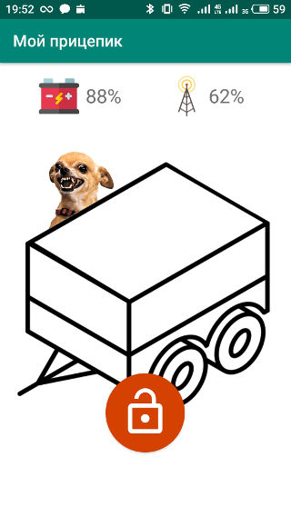

# GPRS сигнализация на SIM800 (beta)
* [Описание проекта](#c-0)
* [Каталоги](#c-1)

## Описание проекта
Крутая GPRS сигнализация разработанная на SIM800 и управляемая с помощью смартфона. 
Первоначально разрабатывалась для легкового прицепа закрытого типа.
В проекте используется свинцовый аккумулятор DT 606.

### Возможности
- Есть приложение на Android (Kotlin)
- Уровень заряда батареи
- Уровень сигнала
- Защита от переразряда
- Автоматическая перезагрузка модема
- Оповещает при пропадании сигнала
- Баланс (в разработке)

### Схема подключения и плата
https://easyeda.com/evildev/guard

### Требования к серверу
- PHP 7
- Redis

## Каталоги
- **android** - приложение для Android
- **arduino** - прошивка для Arduino
- **server** - php сервер